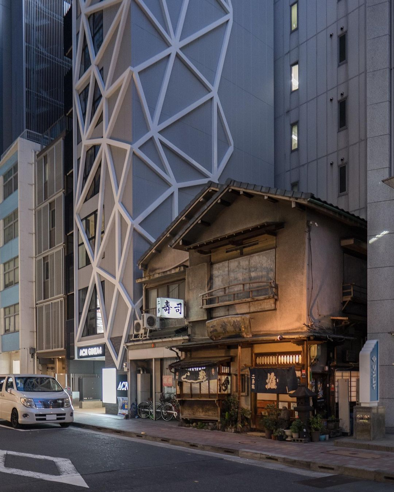
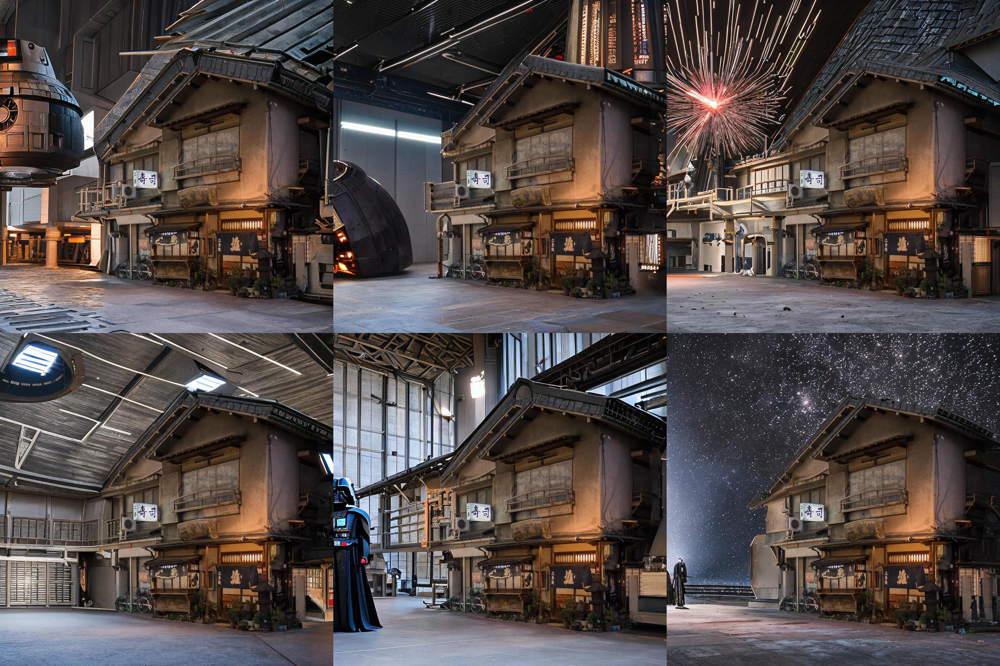
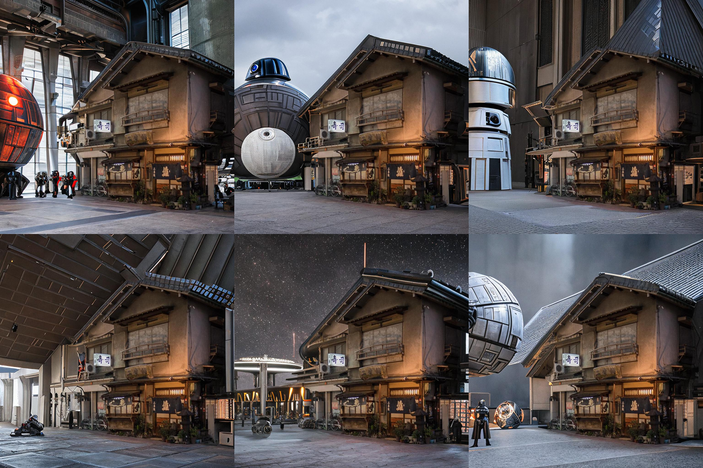

# Stable Diffusion v2 text-conditioned inpainting + upscale model combined experiment

Original image of Futaba Sushi Restaurant in Ginza ([Source](https://www.reddit.com/r/Tokyo/comments/pf5mo2/old_vs_new_futaba_sushi_restaurant_in_ginza_first/))

## Various cities around the world

https://user-images.githubusercontent.com/6318110/209775278-4def981f-cb2f-4a85-9dde-4f38bab285cb.mp4

## Put the restaurant in Darth Vader's home on the Death Star

(1024x1024)

